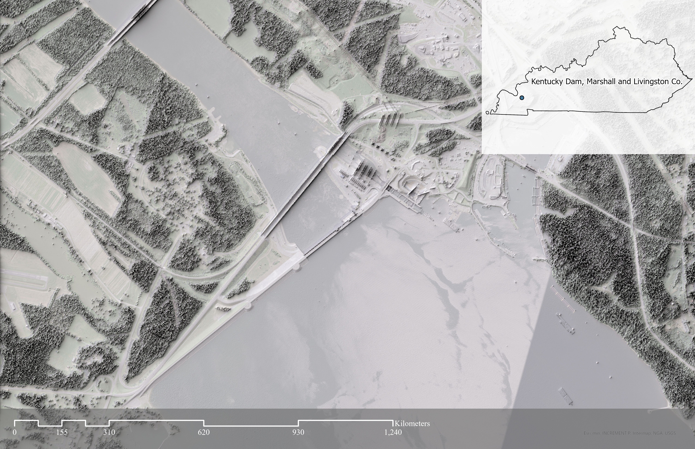
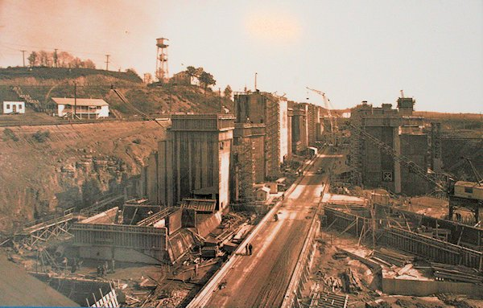
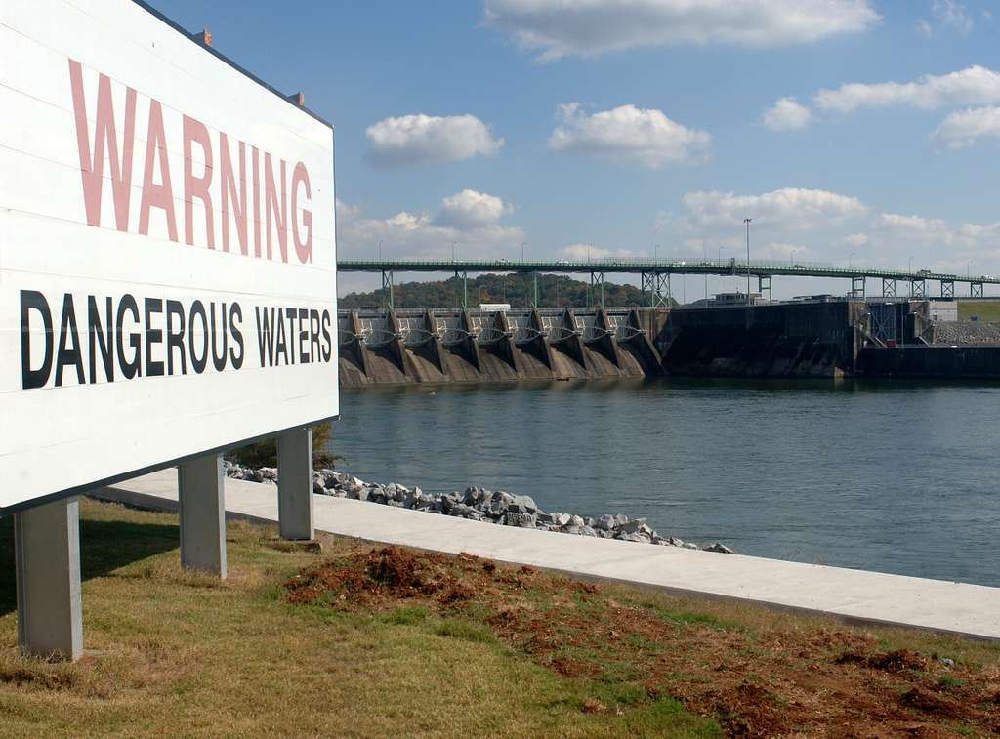
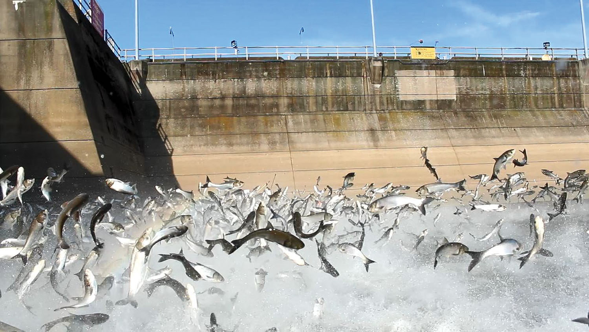
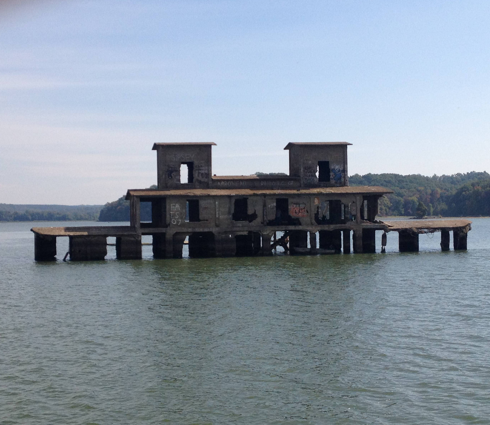

# Kentucky Dam

The Kentukcy Dam is the largest hydroelectric dam in Ky. It sits on the borders of Marshall and Livingston county where it dams the Tennessee River, providing tens of thousands of homes with power

Here is a link to a georefferenced PDF, available to be used on Avenza Maps

This image shows the Construction of the Dam
 

image from KyLake.com

This image shows the dam and its dangerous water sign. The dam is dangerous because of the whirpools produced by its generators
 

Asian Carp are also a huge problem near the dam, the invasive species has decimated native fish in the lakes.

Image source: Jessica Morris, Kentucky Fish and Wildlife

When Kentucky Dam was built, many towns were evacuated. those towns remain under the three bodies of water Barkley Lake, Kentucky Lake, and the Tennessee River

Maps by Reisz Krampe for GEO 409. All data is from Kentucky above and Kentucky NAIP 2018
